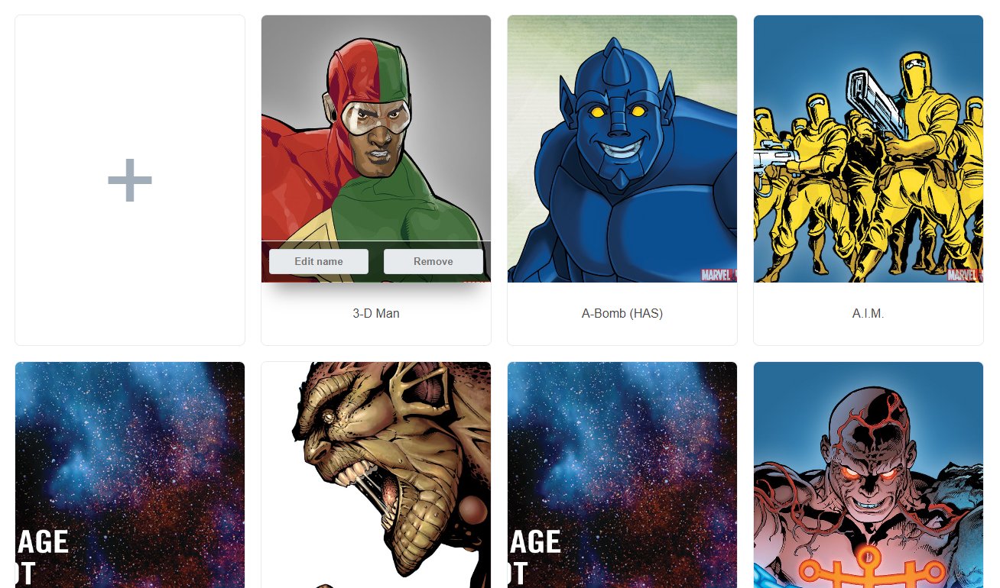

# [Marvel] CRUD API

## Getting Started

### Please clone the git repository

`git clone https://github.com/joelcalheiros/challenge.git`

### Install depandencies

run `yarn` or `npm install`

### Start project

run `yarn start` or `npm run start`

Open [http://localhost:3000](http://localhost:3000) to view it in the browser.

Thanks
